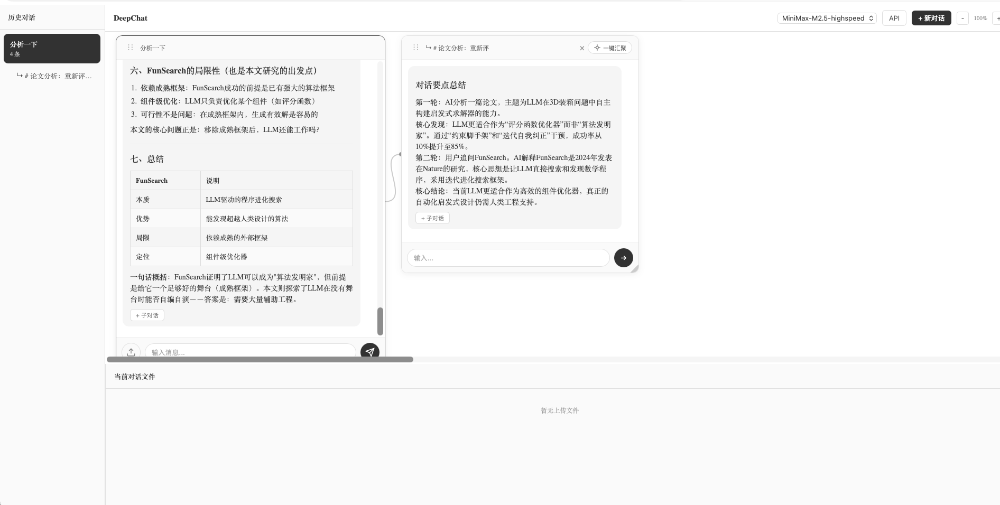
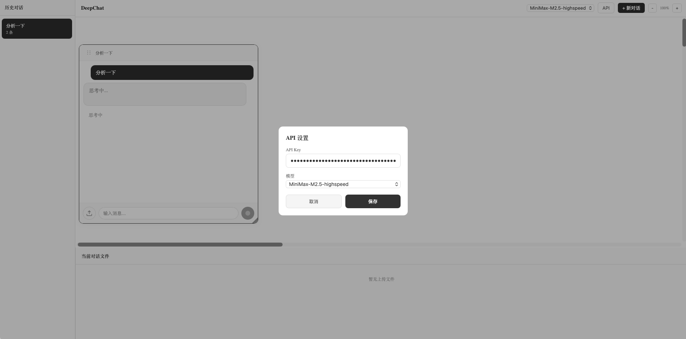

# DeepChat

A modern AI chat application with tree-structured conversations, inspired by mind-map thinking. Built with React, TypeScript, and MiniMax API.

   

## Screenshots

### Tree-structured Conversations


### API Settings


## Introduction

DeepChat is an AI-powered chat application that organizes conversations in a tree structure, similar to a mind map. Each conversation can branch into multiple child conversations, allowing you to explore different topics without losing context. The intuitive drag-and-drop interface makes it easy to organize and navigate complex discussions.

## Features

### Core Features
- **Tree-structured Conversations**: Create parent-child conversation branches, visualize thinking paths like a mind map with connection lines
- **Infinite Canvas**: Freely arrange conversation cards on an unlimited workspace
- **Drag & Resize**: Move cards by dragging the handle (⋮⋮) on card header; resize by dragging the corner handle
- **Trackpad/Trackpoint Zoom**: Smooth zoom with pinch gestures or mouse wheel, throttled for performance

### AI Features
- **MiniMax API Integration**: Stream AI responses with real-time typing effect
- **Web Search**: Built-in DuckDuckGo search for up-to-date information
- **One-click Summarize**: Aggregate all child conversation summaries into parent
- **Multi-model Support**: Switch between different AI models

### File Support
- **Image Attachments**: Upload PNG, JPG, GIF, WebP images
- **PDF Parsing**: Extract text from PDF files using PDF.js
- **Code Highlighting**: Syntax highlighting for multiple languages via highlight.js

### UI/UX
- **Resizable Sidebar**: Adjust the conversation list width
- **Resizable Files Panel**: Adjust the attachments panel height
- **Markdown Rendering**: Full GFM (GitHub Flavored Markdown) support
- **Dark Theme**: Clean gray/black/white design

### Data
- **Local Storage**: Auto-save all conversations and UI state
- **Export**: Export conversations to Markdown format

## Tech Stack

- **Frontend**: React 19 + TypeScript 6
- **Build Tool**: Vite 8
- **AI API**: MiniMax API (streaming)
- **PDF Parsing**: PDF.js
- **Markdown**: react-markdown + remark-gfm
- **Syntax Highlighting**: highlight.js (CDN)
- **Persistence**: localStorage

## Project Structure

```
deepchat/
├── src/
│   ├── App.tsx           # Main application component
│   ├── App.css          # All styles
│   ├── main.tsx         # Entry point
│   ├── index.css        # Base styles
│   ├── types.ts        # TypeScript interfaces
│   ├── ConversationPanel.tsx  # Sidebar component
│   ├── services/
│   │   ├── minimax.ts  # MiniMax API service
│   │   ├── storage.ts  # localStorage service
│   │   ├── search.ts   # Web search service
│   │   └── pdf.ts      # PDF parsing service
│   └── assets/         # Static assets
├── public/
│   └── favicon.svg     # App icon
├── package.json
├── vite.config.ts
└── tsconfig.json
```

## Getting Started

### Prerequisites

- Node.js 18+
- npm 9+

### Installation

```bash
# Clone the repository
git clone https://github.com/inshusheia/deepchat.git

# Navigate to project directory
cd deepchat

# Install dependencies
npm install
```

### Development

```bash
# Start development server
npm run dev
```

The app will be available at `http://localhost:5173`

### Production Build

```bash
# Build for production
npm run build

# Preview the build
npm run preview
```

## Configuration

Click the API button in the toolbar (top-right corner) to configure:

| Setting | Description | Default |
|---------|------------|---------|
| API Key | Your MiniMax API key | - |
| Base URL | API endpoint | `https://api.minimax.chat` |
| Model | Model ID | `abab6.5s-chat` |

### Getting MiniMax API Key

1. Visit [MiniMax Platform](https://platform.minimax.chat)
2. Create an account
3. Navigate to API Keys
4. Create a new API key
5. Copy the key and paste into the app

## Usage Guide

### Creating Conversations

1. Click the **+** button in the toolbar to create a new root conversation
2. Type your message and press Enter or click Send
3. Wait for AI response (streaming)

### Branching Conversations

1. Click the **+** button on any conversation card header
2. A new child conversation will be created
3. The new card is connected to parent with a line
4. Ask follow-up or different questions

### Summarizing

1. Click the **Summarize** button on a parent conversation
2. The app will gather summaries from all child conversations
3. Generate a comprehensive summary
4. Add to parent's messages

### Zooming

- **Trackpad**: Pinch to zoom in/out
- **Mouse Wheel**: Scroll while holding Cmd/Ctrl
- **Toolbar**: Use +/- buttons

### Moving Cards

- Drag the handle (⋮⋮) in the card header
- Cards snap to position on release

### Resizing Cards

- Drag the handle in the bottom-right corner
- Minimum size enforced

### Attaching Files

1. Click the attachment button (paperclip icon) in input area
2. Select image or PDF file
3. File will be uploaded and processed
4. Send message with attachment

### Adjusting Panels

- **Left Sidebar**: Drag the right edge
- **Bottom Files Panel**: Drag the top edge

## Keyboard Shortcuts

| Shortcut | Action |
|----------|--------|
| Enter | Send message |
| Shift+Enter | New line |

## Troubleshooting

### API Error

- Check your API key is correct
- Verify model name
- Check network connection

### Files Not Loading

- Supported formats: PNG, JPG, GIF, WebP, PDF
- Max file size: 10MB

### Canvas Not Responsive

- Refresh the page
- Clear browser cache

## License

MIT License - see [LICENSE](LICENSE) for details.

## Acknowledgments

- [MiniMax](https://minimax.chat) - AI API
- [Vite](https://vitejs.dev) - Build tool
- [React](https://react.dev) - UI library
- [PDF.js](https://mozilla.github.io/pdf.js/) - PDF parsing